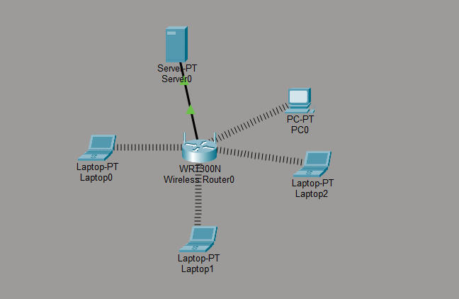
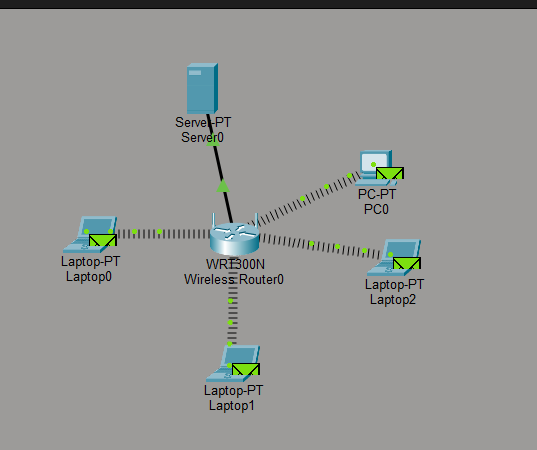
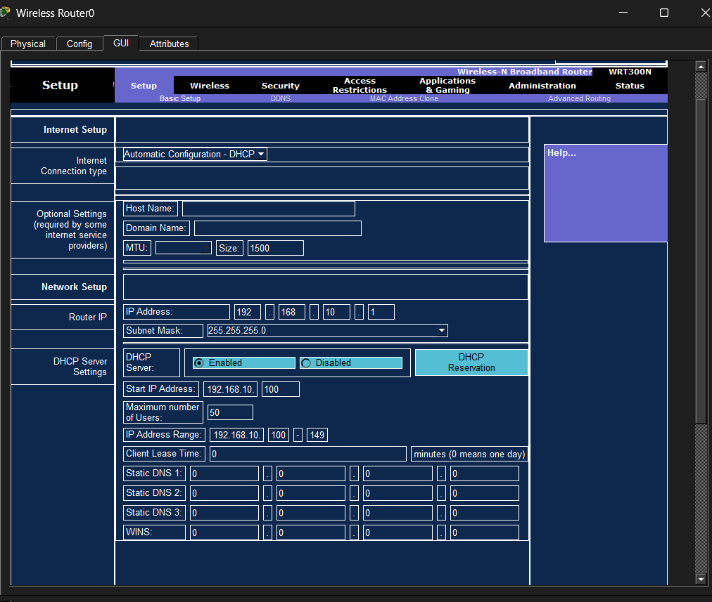

# Design and Development of Wi-Fi 6 (802.11ax) Wireless Local Area Network Architecture

## Team Members

* Mohammed Rayhaan Khan (192511006)
* Deepak R (192511008)
* Emad Farooqui (192511019)

---

## My Contributions (Deepak R)

I was responsible for the development and implementation of **Module 2 – Configuration and Optimization**.

### Key Contributions

* Configured the Wi-Fi 6 network architecture in Cisco Packet Tracer.
* Assigned IP addressing and DHCP settings for wireless clients.
* Configured SSID and wireless communication parameters.
* Optimized network performance through bandwidth and connectivity settings.
* Verified communication between wireless devices and server nodes.
* Assisted in testing, troubleshooting, and validating network performance.
* Contributed to project documentation and presentation preparation.

---

## Technologies Used

* Cisco Packet Tracer
* Wi-Fi 6 (802.11ax)
* Wireless Networking
* DHCP Configuration
* WLAN Architecture Design

---

## Features

* Wi-Fi 6 Wireless Network Design
* DHCP-Based IP Address Allocation
* Wireless Client Connectivity
* Server Integration
* Network Configuration and Optimization
* Packet Transmission Simulation
* WLAN Performance Validation

---

## Project Overview

This project focuses on the design and development of a Wi-Fi 6 (802.11ax) Wireless Local Area Network (WLAN) architecture using Cisco Packet Tracer. The system demonstrates wireless communication between multiple client devices and a centralized server through a Wi-Fi 6 router.

The project aims to improve wireless connectivity, efficient IP allocation, and network performance while simulating real-world WLAN deployment scenarios.

---

## Screenshots

### Network Topology



### Packet Transmission Simulation



### Router Configuration



---

## Project Files

* `cap.pkt` – Cisco Packet Tracer Network Simulation
* `WiFi6_Network_Architecture_Presentation.pptx` – Project Presentation
* `WiFi6_Network_Architecture_Report.pdf` – Detailed Project Report

---

## Network Configuration

### Router Settings

* Router IP Address: `192.168.10.1`
* Subnet Mask: `255.255.255.0`
* DHCP: Enabled
* Start IP Address: `192.168.10.100`
* Maximum Users: `50`

### Connected Devices

* Wireless Router (WRT300N)
* Server
* Desktop PC
* Multiple Laptop Clients

---

## Expected Outcome

* Successful wireless communication between clients and server.
* Automatic IP assignment through DHCP.
* Efficient wireless connectivity using Wi-Fi 6 architecture.
* Stable packet transmission and network performance.

---

## How to Run

1. Install Cisco Packet Tracer.
2. Open the file:

```text
WiFi6_Network_Architecture.pkt
```

3. Start the simulation.
4. Verify wireless connectivity between devices.
5. Test packet transmission using Simulation Mode.

---

## Learning Outcomes

* Understanding Wi-Fi 6 WLAN Architecture.
* Wireless Router Configuration.
* DHCP and IP Address Management.
* Network Optimization Techniques.
* WLAN Testing and Troubleshooting.

---

## License

This project is created for academic and educational purposes.
